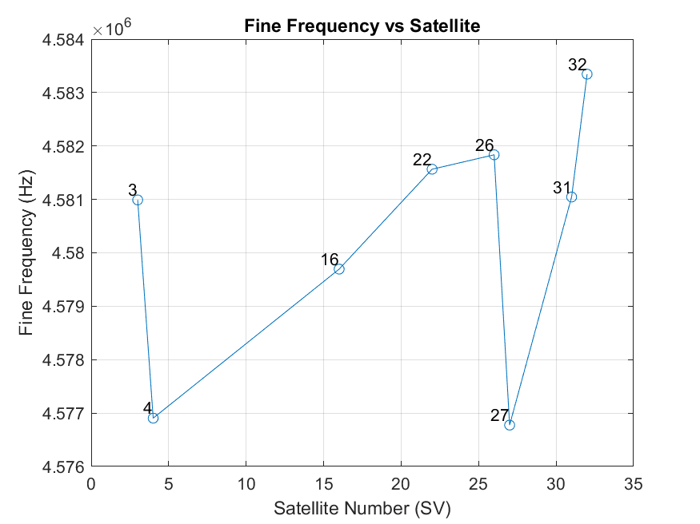
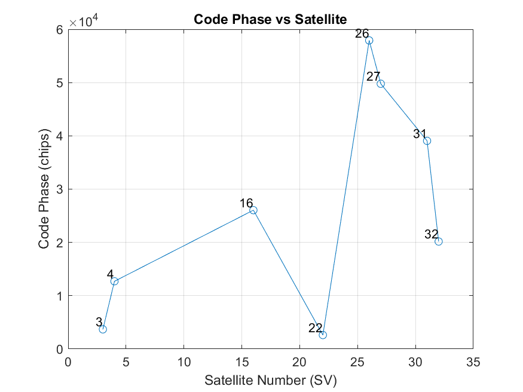

# Assignment 1 Report

**Course:** AAE6102 Satellite Communication and Navigation  
**Institution:** The Hong Kong Polytechnic University, Department of Aeronautical and Aviation Engineering  
**Semester:** 2024/25 Semester 2  
**Student:** Li Peisen (23126149r)

---

## Overview

This report analyzes and evaluates GNSS signal processing under two environments: **OpenSky** and **Urban**. The analysis is divided into five tasks covering acquisition, tracking, navigation data decoding, positioning using Weighted Least Squares (WLS), and positioning using an Extended Kalman Filter (EKF). All images referenced below are included in this repository.

---

## Table of Contents

1. [Task 1 – Acquisition](#task-1--acquisition)
   - [1.1 OpenSky](#11-opensky)
   - [1.2 Urban](#12-urban)
2. [Task 2 – Tracking](#task-2--tracking)
   - [2.1 OpenSky](#21-opensky)
   - [2.2 Urban](#22-urban)
3. [Task 3 – Navigation Data Decoding](#task-3--navigation-data-decoding)
   - [3.1 OpenSky](#31-opensky)
   - [3.2 Urban](#32-urban)
4. [Task 4 – Position and Velocity Estimation (WLS)](#task-4--position-and-velocity-estimation-wls)
   - [4.1 OpenSky](#41-opensky)
   - [4.2 Urban](#42-urban)
5. [Task 5 – Kalman Filter-based Positioning (EKF)](#task-5--kalman-filter-based-positioning-ekf)
   - [5.1 OpenSky](#51-opensky)
   - [5.2 Urban](#52-urban)
6. [Ephemeris Parameters Overview](#ephemeris-parameters-overview)
7. [Conclusion](#conclusion)

---

## Task 1 – Acquisition

### 1.1 OpenSky

## Task 1 – Acquisition

### 1.1 OpenSky

  

    
    
<strong>SNR:</strong> All selected satellites have SNR values above the 16 dB-Hz threshold, some reaching 40–50 dB-Hz.

  

  

    
    
<strong>Doppler Shift:</strong> Ranges from about -2000 Hz to +2000 Hz.

  

  

    
    
<strong>Fine Frequency:</strong> Small deviations confirm proper frequency alignment.

  

  

    
    
<strong>Code Phase:</strong> Variation indicates different signal travel times, consistent with open-sky conditions.

  

- **SNR:** All selected satellites have SNR values above the 16 dB-Hz threshold, some reaching 40–50 dB-Hz.
- **Doppler Shift:** Ranges from about -2000 Hz to +2000 Hz.
- **Fine Frequency:** Small deviations confirm proper frequency alignment.
- **Code Phase:** Variation indicates different signal travel times, consistent with open-sky conditions.

### 1.2 Urban

  

    
    
<strong>SNR:</strong> Fewer satellites exceed the 11 dB-Hz threshold, indicating weaker signal quality.

  

  

    
    
<strong>Doppler Shift:</strong> Greater variability reflects challenging propagation due to multipath and non-line-of-sight effects.

  

  

    
    
<strong>Fine Frequency:</strong> Greater variability reflects challenging propagation due to multipath and non-line-of-sight effects.

  

  

    
    
<strong>Code Delay:</strong> Greater variability reflects challenging propagation due to multipath and non-line-of-sight effects.

  

- **SNR:** Fewer satellites exceed the 11 dB-Hz threshold, indicating weaker signal quality.
- **Doppler, Code Phase, Fine Frequency:** Greater variability reflects challenging propagation due to multipath and non-line-of-sight effects.

---

## Task 2 – Tracking

### 2.1 OpenSky

- **Correlation Functions:** Well-defined peaks in the in-phase channels (e.g., satellites 22 and 32) indicate stable tracking.
- **Multipath:** Minimal, as shown by small quadrature components.
- **Code Lock:** Robust performance in open-sky conditions.

### 2.2 Urban

- **Correlation Peaks:** More distorted and less pronounced (e.g., satellites 3 and 22) due to stronger multipath effects.
- **Fluctuations:** Increased variation in both in-phase and quadrature components reflect challenging tracking conditions.

---

## Task 3 – Navigation Data Decoding

### 3.1 OpenSky

- **Ephemeris Data:** Decoded navigation data is grouped into:
  - **Core Ephemeris Parameters:** Semi-major axis, eccentricity, inclination, right ascension, and argument of perigee.
  - **Clock Corrections:** Parameters such as af0, af1, af2, and TGD.
  - **Health/Validity Fields:** Such as IODE and SV health.
  - **Reference Times:** TOW, TOE, and TOC for proper orbital and clock modeling.

### 3.2 Urban

- **Ephemeris Data:** Similar to OpenSky, providing essential orbital parameters and clock corrections for positioning, with processing adapted for urban conditions.

---

## Task 4 – Position and Velocity Estimation (WLS)

### 4.1 OpenSky

- **Positioning:** WLS solutions form a tight cluster, indicating high accuracy with minimal multipath interference.
- **Velocity:** Components (Vx, Vy, Vz) remain stable and close to zero, reflecting reliable motion estimates.

### 4.2 Urban

- **Positioning:** WLS solutions exhibit a broader scatter due to multipath and signal blockages.
- **Velocity:** Greater fluctuations in Vx, Vy, and Vz indicate reduced reliability in motion estimates under urban conditions.

---

## Task 5 – Kalman Filter-based Positioning (EKF)

### 5.1 OpenSky

- **EKF Positioning:** Produces a tight cluster of position estimates, reflecting stable satellite geometry and minimal multipath.
- **Improved Velocity:** Smoother and more consistent velocity estimates due to the dynamic model and prior state incorporation.

### 5.2 Urban

- **EKF Positioning:** Position estimates are more scattered due to multipath and signal blockages.
- **Velocity Variability:** Despite some noise reduction from the EKF, velocity components still show significant fluctuations in urban environments.

---

## Ephemeris Parameters Overview

| **Parameter**                         | **Definition**                                                                                                                         |
|---------------------------------------|----------------------------------------------------------------------------------------------------------------------------------------|
| **Semi-major axis (A)**               | The size of the satellite’s orbit; the average distance from the Earth's center to the satellite.                                        |
| **Eccentricity (e)**                  | Describes the orbit's deviation from a circle (0 = circular, near 1 = highly elliptical).                                                 |
| **Inclination (i)**                   | The angle between the orbital plane and the Earth's equatorial plane.                                                                    |
| **Right Ascension (Ω)**               | Angle in the equatorial plane from a reference direction to the ascending node, where the satellite crosses the equator northbound.         |
| **Argument of Perigee (ω)**           | The angle from the ascending node to the satellite's closest approach (perigee) to Earth.                                                 |
| **Mean Anomaly at Reference Time (M₀)** | Indicates how far the satellite has traveled along its orbit from perigee at the reference time.                                           |
| **Ω̇ (Rate of Right Ascension)**       | The rate at which the right ascension changes over time.                                                                                 |
| **IDOT (Rate of Inclination)**         | The rate of change of the inclination angle over time.                                                                                   |
| **Cuc, Cus, Crc, Crs, Cic, Cis**       | Correction terms for orbital perturbations in radial, along-track, and cross-track directions.                                             |
| **af₀, af₁, af₂ (Clock Terms)**        | Parameters representing the satellite clock offset, drift, and drift rate used for clock correction.                                        |
| **TGD (Group Delay)**                  | Corrects for differences in signal paths due to hardware or other factors.                                                                 |
| **IODE (Issue of Data Ephemeris)**       | Version number indicating the current set of ephemeris data.                                                                               |
| **TOE, TOC, TOW (Times)**              | Reference times for ephemeris (TOE), clock (TOC), and week/time-of-week (TOW) calculations.                                                 |
| **SV Health**                          | Status indicator showing whether the satellite is operationally healthy or experiencing issues.                                            |

---

## Conclusion

The analysis shows that under OpenSky conditions, both WLS and EKF methods yield robust positioning with tight clusters and stable velocity estimates due to strong signal quality and minimal multipath. In contrast, urban environments introduce significant challenges—multipath effects and signal blockages lead to broader scatter in position estimates and higher variability in velocity measurements. This comprehensive evaluation across acquisition, tracking, navigation data decoding, and positioning illustrates the differing impacts of environmental conditions on GNSS performance.

---

*Note: All images referenced in this document are included in the repository. Ensure that the image paths (e.g., `images/task1_opensky.png`) match the actual locations of your image files.*
